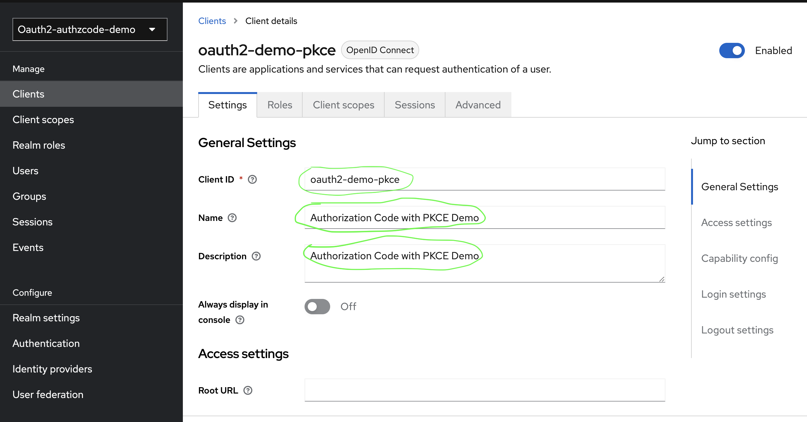
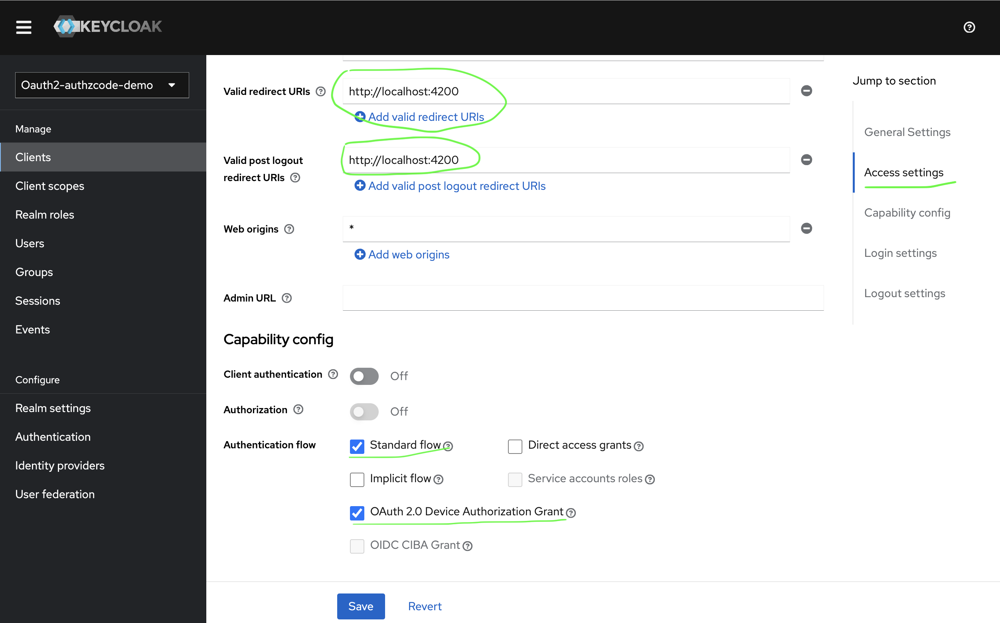
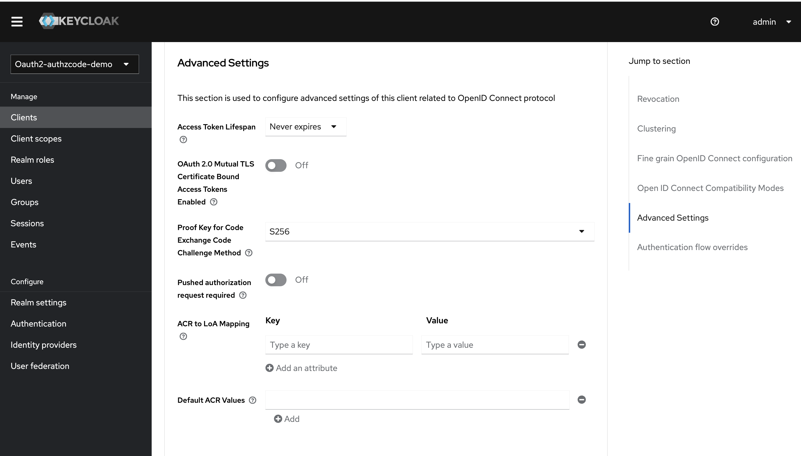

# Client App Authorization Code with PKCE

### Pre-requisites
- Install node in your PC [NodeJS Download](https://nodejs.org/en/download)
- Start the KeyCloak instance <https://www.keycloak.org/>

This project was generated with [Angular CLI](https://github.com/angular/angular-cli) version 16.2.5.
- `node --version && npm --version`
- `npm install && npm start`. Navigate to [localhost:4200](http://localhost:4200/). The application will automatically reload if you change any of the source files.

Follow below steps if you would like to create SPA from scratch, otherwise skip below steps
```shell
  CLIENT_APP_NAME=client-app-authz-code-pkce
  sudo npm install -g @angular/cli &&
  mkdir ${CLIENT_APP_NAME} &&
  ng new ${CLIENT_APP_NAME} &&
  npm install angular-oauth2-oidc &&
  npm start
```

### Create Realm 
- `Administration Console -> Create Realm`
- `Realm Settings -> Endpoints -> OpenID Endpoint Configuration -> Note the Issuer URL`

### Create the client and demo user in KeyCloak (Authorization Server)
1. 
2. 
3. 

### Create a demo user
- `Administration Console -> Select Realm -> Create User -> `

### Update the SPA with OauthService
#### Update the `auth.config.ts` with clientId and issuer
```shell
import {AuthConfig} from 'angular-oauth2-oidc'
export const authConfig: AuthConfig = {
  issuer: 'http://localhost:8080/realms/oauth2-authzcode-demo',
  redirectUri: window.location.origin,
  clientId: 'oauth2-demo-pkce',
  responseType: 'code',
  strictDiscoveryDocumentValidation: true,
  scope: 'openid profile email offline_access',
}
```
[Access localhost:4200](http://localhost:4200)
[Login](images/auth-code-with-pkce-login.png "Request for Authorization Code")
[Token](images/auth-code-with-pkce-token.png "Token call with auth code")


### Reference
[Angular Oauth2 OIDC](https://github.com/manfredsteyer/angular-oauth2-oidc)

[Steps to create a code challenge](https://datatracker.ietf.org/doc/html/rfc7636#section-4.2)

[Tool to generate code challenge](https://tonyxu-io.github.io/pkce-generator/)
